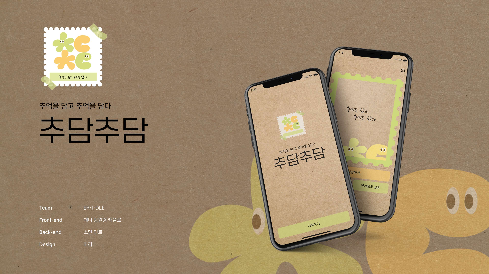

# 추담추담

 

## 💌 프로젝트 소개

  

 

**추억을 담고 추억을 담다**

모바일 메세지나 선물하기 카드는 형식적이거나 일회성인 경향이 있는데요,  
**추담추담**은 정성이 느껴지는 손편지의 장점과 이미지 공유와 저장이 쉽고 간편하다는 모바일의 장점을 담은 **'모바일 편지'** 서비스입니다.

 

## 🗓️ 스프린트 일정
> **스프린트**란? 짧은 기간동안 협업을 통해 '서비스 기획-설계-디자인-프로토타입-테스트’를 이루어내는 과정

- **서비스 기획**  : 2024.04.03 ~ 2024.04.05 (3일)
- **MVP 개발** : 2024.04.06 ~ 2024.04.08 (3일)
 

### 주요 논의
#### Day01. 팀 캔버스
- 팀원의 개인적 목표뿐 아니라, 팀의 공통 목표를 확인하고 맞추는 시간
- 원활한 협업을 위하여 서로의 니즈와 기대, 강약점을 공유하며 서로를 알아가는 과정

        "협업을 통한 커뮤니케이션 능력 향상시키기"
        "모두가 편하게 즐길수 있는 퀴즈 서비스 만들기"

#### Day02. 서비스 맵
* 각자의 아이디어를 발산함으로써 서비스의 궁극적인 목적, 주요 대상, 핵심 가치를 공유

        "간직하고 싶은 모바일 편지를 쓰고 공유해요"
        "마음을 전달하고 싶은 누구나 쉽게 사용 가능해요"

* 서비스의 메인 및 서브 기능을 공유

        "온보딩과 편지지 선택 과정을 거쳐 편지를 작성해요"
        "작성한 편지를 링크와 카카오톡 공유하기로 전달해요"

#### Day03. 서비스 스케치 및 BDD/SDD
* 서비스의 화면을 스케치하고 임팩트와 노력을 고려하여 기능의 우선순위를 설정
* 타겟 유저와 유저의 행동을 재확인하며 기능을 설계

#### Day04~06. MVP 제작 및 데모
* 주요 기능을 태스크로 나누어 구현 진행
* 상시 논의를 통해 협업하며 기능 개발
* MVP 데모 진행

 

## 💻 핵심 기능

<table style="border-collapse: collapse; width: 100%; border: none;">
  <tr style="border: none;">
    <td style="width: 50%; text-align: center; padding: 10px; vertical-align: top; border: none;">
      <b>[Step 1] 받는 이와 보내는 이를 알려주세요.</b>
        
      
    </td>
    <td style="width: 50%; text-align: center; padding: 10px; vertical-align: top; border: none;">
      <b>[Step 2] 편지지를 골라볼까요? 사진과 함께 쓸 수도 있어요.</b>
        
      
    </td>
  </tr>
  <tr style="border: none;">
    <td style="width: 50%; text-align: center; padding: 10px; vertical-align: top; border: none;">
      <b>[Step 3] 추억을 담은 편지를 작성하고 꾸며보세요.</b>
        
      
    </td>
    <td style="width: 50%; text-align: center; padding: 10px; vertical-align: top; border: none;">
      <b>[Step 4] 소중한 사람에게 편지를 보내보세요.</b>
        
      
    </td>
  </tr>
</table>

<!-- [**편지 작성**]
| 홈 | 온보딩 | 편지지 고르기 |
| -- | ---   |-------------|
|    |          |          |

| 편지 작성하기 | 편지 미리보기 |
| -------- | -------- |
|   |   |

| 정답 공개  | 풀이 결과  |
| -------- | -------- |
|   | |

[**편지 공유하기**]
| 링크 공유 | 카카오톡 공유 | 저장하기    |
| ------- | ---------    | ---------- |
|        |       |       | -->

 

## 👨‍👩‍👧‍👦 팀 소개

|                Design                |     Backend      |     Backend     |     Frontend     |     Frontend     |     Frontend     |
| :----------------------------------: | :--------------: | :--------------: | :--------------: | :--------------: | :--------------: |
| 마리 | 민트 | [소면](https://github.com/songhyeonpk) | 대니(PL) | 캐쓸로 | 망원경 |

 

## ⚙️ 개발 환경
[ Front-End ]

    
    
    
    
    
<!--     
     -->

  

[ Back-End ]

<!--     
    
     -->
  
  
    
        
<!--      -->

  

[ Infra / CI-CD ]

    
    
    

  
<!--      -->
<!--      -->
    
[ Design ]

    

  

[ Communication ]

    
    

